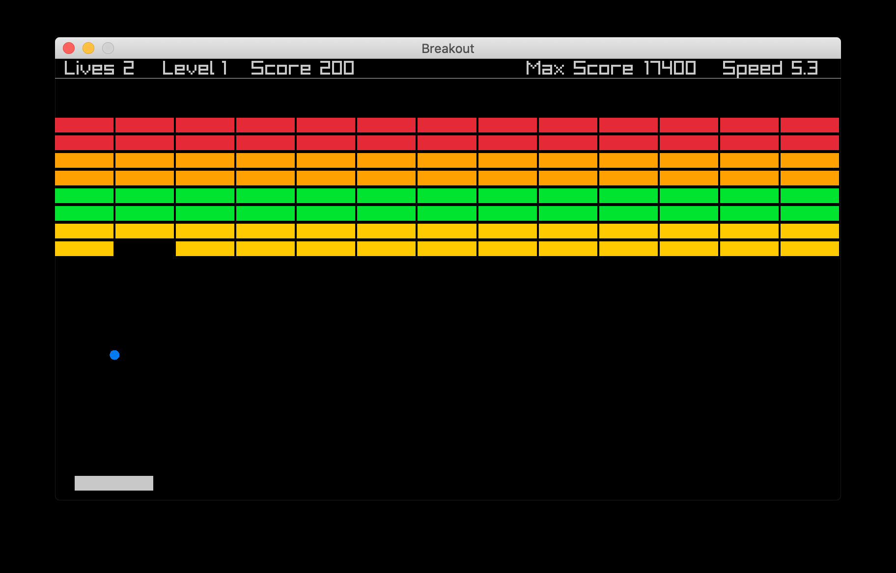

# Breakout

A quick little project to build Breakout.
Trying out [Raylib](https://www.raylib.com) for [Go](https://github.com/gen2brain/raylib-go) as a library.

Features:
- Simple no thrills single threaded game loop.
- Some quick and dirty transition screens.
- Ability to save a max score to a file between runs.

Potential Improvements:
- Paddle reflection technique could be more complex

## Build 

`go build`
`./breakout`

## Run Debug

`go run *.go`